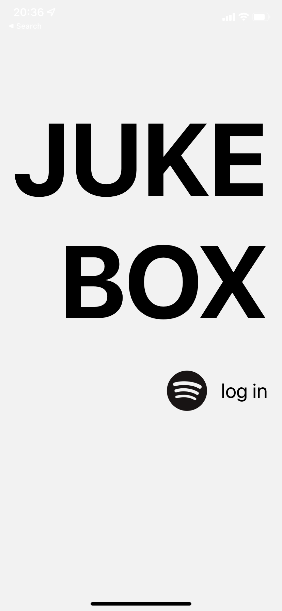

<!-- ABOUT THE PROJECT -->

## About The Project

<!--  -->



## Demo

Check out the [video](https://youtu.be/cMgCdsXk0VM) for a brief overview of the app.

### Built With

- [React Native](https://reactnative.dev/)
- [JavaScript](https://www.javascript.com/)
- [Expo.dev](https://expo.dev/)
- [Spotify API](https://developer.spotify.com/)

<!-- GETTING STARTED -->

## Getting Started

To get a local copy up and running follow these simple example steps.

## Installation

- Clone this repo

  ```sh
  git clone https://github.com/your_username_/Project-Name.git
  ```

- Install NPM packages

  ```sh
  npm install
  ```

- Download the Expo Go app

- Create a developer profile in Spotify Developer

- Create a .env file in in the root folder with the CLIENT_ID and REDIRECT_URI you have set up

  ```js
  CLIENT_ID = 'YOUR CLIENT ID';
  REDIRECT_URI = 'REDIRECT_URI';
  ```

- start
  ```sh
  expo start
  ```
- scan the QR code

## License

Distributed under the MIT License. See `LICENSE.txt` for more information.

<!-- CONTACT -->

## Contact

Alexandra Plana - [LinkedIn](https://www.linkedin.com/in/alexandra-plana/)

<!-- MARKDOWN LINKS & IMAGES -->
<!-- https://www.markdownguide.org/basic-syntax/#reference-style-links -->

<!-- [login-img]: /assets/readme-img/login.png -->
